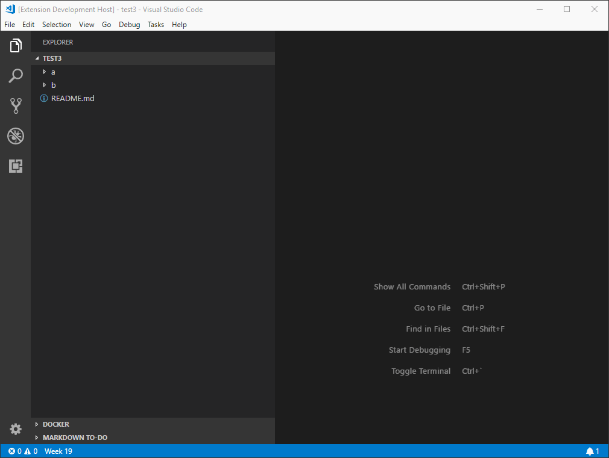

# [MarkDown Link Suggestions](https://marketplace.visualstudio.com/items?itemName=TomasHubelbauer.vscode-markdown-link-suggestions)

Suggests workspace files and MarkDown file headers in MarkDown links.

## Installing

Either [Click *Install* in the Visual Studio Marketplace](https://marketplace.visualstudio.com/items?itemName=TomasHubelbauer.vscode-markdown-link-suggestions)
or search for *markdown link suggestions* in VS Code Extensions pane.

## Updating

See the [release history](CHANGELOG.md).

Visual Studio Code will update the extension for you automatically by default.
If you wish to change this behavior, set `extensions.autoUpdate` configuration value to `false` in VS Code's `settings.json`.

## Running

- Run `npm run generate` first if you want to work on the link context recognizer spike
Use the VS Code *Extension* debug configuration by pressing F5.

## Testing

- Travis  on Linux & macOS
- Azure CI:
  -  on Windows
  -  on Linux
  -  on macOS

Run tests either using VS Code *Extension Tests* debug configuration or by running a platform appropriate test command:

- `npm run test:posix`
- `npm run test:win32`

It's recommended the extension is tested locally for a few days before rolling it out after bigger changes have been made:

- Disable the Marketplace version of the extension
- Execute `vsce package`
- Use the *Install from VSIX…* command to install the VSIX package version

## Deploying

Deploying is not currently done on CI, instead it is manual:

## Publishing

- Run tests
- Update version
- Update changelog
- Execute `vsce publish`

## Contributing

See [the todoes](todo).

## Monitoring

This extension uses ApplicationInsights from Azure for telemetry and events collected include:

- activation
- suggestion
- deactivation

After initial testing, the event scope will be reduced to just suggestion errors to aid in fixing.

**If you'd prefer telemetry not be collected, pleae disable VS Code telemetry.**

[You can learn how to do so here](https://code.visualstudio.com/docs/supporting/FAQ#_how-to-disable-telemetry-reporting).

The extension respects the VS Code setting and will not send telemetry events against your wishes.

[MarkDown-Link-Suggestions - Events](https://portal.azure.com/#@tomashubelbauerlive.onmicrosoft.com/resource/subscriptions/808a4574-3b06-4368-ab54-bb29b1da0974/resourcegroups/VSCode-Extensions/providers/microsoft.insights/components/MarkDown-Link-Suggestions/events)
