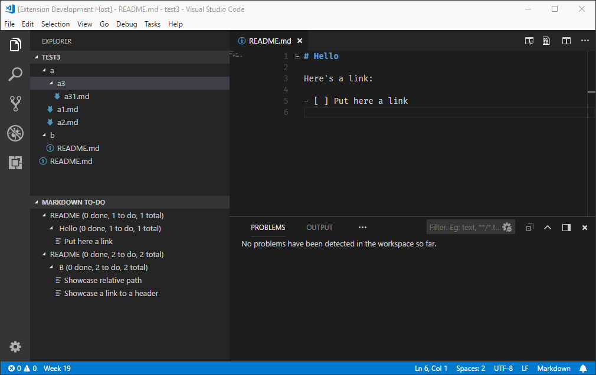

# MarkDown Link Suggestions

Suggests local files and local MarkDown file headers when typing MarkDown links targets.

## Release Notes

See the [change log](CHANGELOG.md).

[In the Marketplace](https://marketplace.visualstudio.com/items?itemName=TomasHubelbauer.vscode-markdown-link-suggestions)
